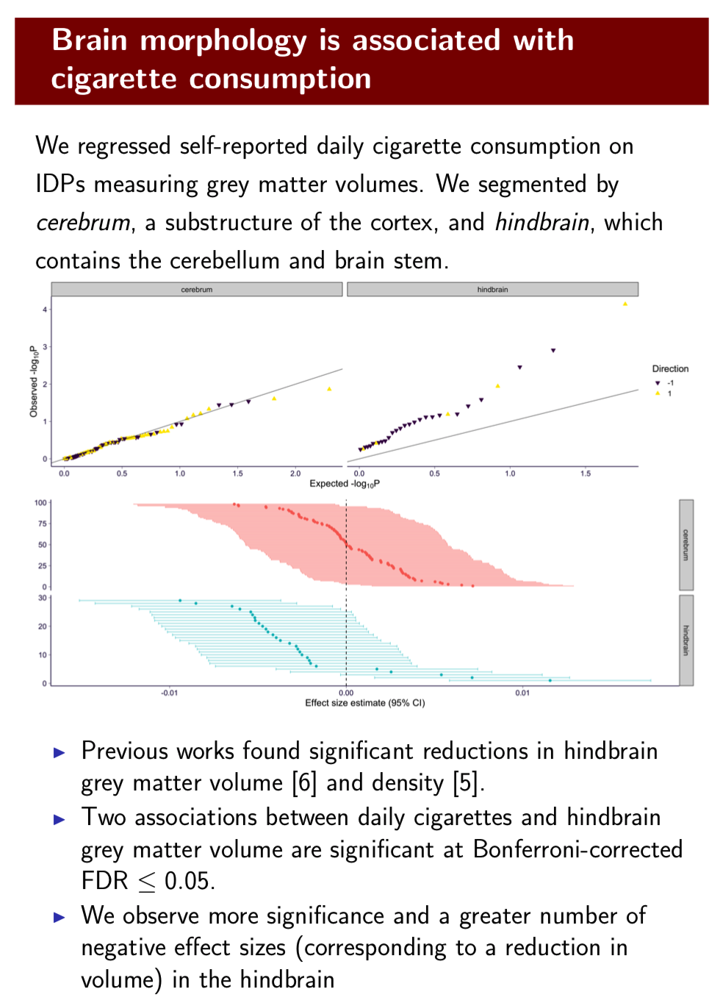

```{r setup}
rm(list = ls())
library(ggplot2)
theme_set(theme_bw(base_size = 15))
source('https://gist.githubusercontent.com/liangyy/43912b3ecab5d10c89f9d4b2669871c9/raw/3ca651cfa53ffccb8422f432561138a46e93710f/my_ggplot_theme.R')
library(dplyr)
options(stringsAsFactors = F)
library(patchwork)
source('rlib.R')
pheno_interest = c('weekly_alcohol', 'recurrent_depressive_disorder', 'parent_depression', 'parent_AD', 'handedness', 'daily_coffee', 'daily_cigarettes')
```

# About

Here we have special focus on grey matter IDPs to re-visit Owen's founding as described below.



I load the IDPs annotation by reusing Owen's code [here](https://github.com/hakyimlab/ImageXcan_analysis/blob/master/analysis/smoking_grey_matter.Rmd).

# Load grey matter annotations

```{r}
grey_matter_rds = '../misc_data/grey_matter_idp.rds'
if(!file.exists(grey_matter_rds)) {
  library(stringr)
  idps = readRDS('../misc_data/download_some_matching_files/cleanup_annot_our_idps.rds')
  grey_matter <- idps %>% filter(str_detect(str_to_lower(Field), "grey"))
  # copy from Owen's code
  find_subregion <- function(df, brain_regions=BRAIN_REGIONS) {
    df$subregion <- purrr::rep_along(df[,1], "other")
    df <- (df %>%
             mutate(notes_ = str_to_lower(Notes)))
    for (i in names(brain_regions)){
      for (j in brain_regions[[i]]){
        # print(j)
        # print(i)
        df <- (df %>%
                 mutate_cond(str_detect(notes_, j), subregion=i))
      }
    }
    # df <- (df %>%
    #          arrange(subregion, -1 * estimate) %>%
    #          mutate(index = 1:nrow(df)))
    # df <- (df %>%
    #          group_by(subregion) %>%
    #          mutate(index_region = order(estimate, decreasing = TRUE)))
    return(df %>% select(-c(notes_)))
  }
  mutate_cond <- function(.data, condition, ..., envir = parent.frame()) {
    # MANY THANKS to StackOverflow user G. Grothendieck for this code.
    # https://stackoverflow.com/questions/34096162/dplyr-mutate-replace-several-columns-on-a-subset-of-rows
    condition <- eval(substitute(condition), .data, envir)
    .data[condition, ] <- .data[condition, ] %>% mutate(...)
    .data
  }
  BRAIN_REGIONS <- list('cerebrum'=c('cortex',
                                     'gyrus',
                                     'amygdala', 
                                     'hippocampus',
                                     'putamen',
                                     'pallidum',
                                     'striatum',
                                     'caudate',
                                     'cortical'),
                        'diencephalon'=c('thalamus'),
                        'hindbrain'=c('cerebellum',
                                      'medulla',
                                      'pons',
                                      'stem'))
  
  grey_matter <- find_subregion(grey_matter, BRAIN_REGIONS)
  table(grey_matter$subregion) %>% pander::pander()
  grey_matter = grey_matter %>% mutate(IDP = paste0('IDP-', FieldID))
  saveRDS(grey_matter, grey_matter_rds)
} else {
  grey_matter = readRDS(grey_matter_rds)
}
```

# Load ImageXcan results

```{r}
df = read.csv('~/Desktop/tmp/ukb_idp/data/imagexcan_round_1.linear.t1.csv') %>% 
  filter(IDP %in% paste0('IDP-', grey_matter$FieldID), phenotype %in% pheno_interest) %>% 
  left_join(grey_matter %>% select(IDP, subregion), by = 'IDP')
dfs = read.csv('~/Desktop/tmp/ukb_idp/data/imagexcan_round_1.susie.t1.csv') %>% 
  filter(IDP %in% paste0('IDP-', grey_matter$FieldID), phenotype %in% pheno_interest) %>% 
  left_join(grey_matter %>% select(IDP, subregion), by = 'IDP')
```

# Visualizing results

```{r}
df %>% filter(phenotype == 'daily_cigarettes') %>% ggplot() + 
  geom_violin(aes(x = subregion, y = bhat)) +
  geom_jitter(aes(x = subregion, y = bhat), height = 0, width = 0.2) + th
df %>% filter(phenotype == 'daily_cigarettes') %>% mutate(pexp = rank(pval) / (n() + 1)) %>% 
  ggplot() + geom_point(aes(x = -log10(pexp), y = -log10(pval))) + 
  facet_wrap(~subregion) + th2 + geom_abline(slope = 1, intercept = 0)
dfs %>% filter(phenotype == 'daily_cigarettes') %>% ggplot() + 
  geom_violin(aes(x = subregion, y = pip)) +
  geom_jitter(aes(x = subregion, y = pip), height = 0, width = 0.2) + th
```

# Association between observed IDPs

```{r}
df_pheno = data.table::fread('~/Desktop/tmp/ukb_idp/phenotypes/2020-04-10_collected-phenotypes.txt', sep = '\t', data.table = F)
df_covar = data.table::fread('~/Desktop/tmp/ukb_idp/phenotypes/2019-12-17_psychiatric-trait_covariates.csv', sep = ',', data.table = F)
df_pc = data.table::fread('~/Desktop/tmp/ukb_idp/phenotypes/query_phenotypes_output.csv', sep = ',', data.table = F)
df_idp = arrow::read_parquet('~/Desktop/tmp/ukb_idp/idp_phenotypes/2020-05-18_final-phenotypes.parquet')
common_indiv = intersect(df_idp$individual, as.character(df_pheno$eid))
common_indiv = intersect(common_indiv, as.character(df_covar$eid))
common_indiv = intersect(common_indiv, as.character(df_pc$eid))
df_pheno = df_pheno[ match(common_indiv, as.character(df_pheno$eid)), ]
df_covar = df_covar[ match(common_indiv, as.character(df_covar$eid)), ]
df_pc = df_pc[ match(common_indiv, as.character(df_pc$eid)), ]
df_idp = df_idp[ match(common_indiv, df_idp$individual), ]
df_covar = cbind(df_covar[, c('sex', 'age_recruitment')], df_pc[, c(paste0('pc', 1 : 10))])
df_covar$age_squared = df_covar$age_recruitment ^ 2
df_covar$sex_x_age = df_covar$age_recruitment * df_covar$sex
df_covar$sex_x_age_squared = df_covar$age_squared * df_covar$sex
```

# Draw association between observed phenotypes

```{r}
source('https://gist.githubusercontent.com/liangyy/489d1519dd45246caf4756d7722bfa25/raw/90c572c0a287f2cada53811c7cd51ec14fade488/fast_linear_regression')
res = fast_linear_regression(df_pheno$daily_cigarettes, as.matrix(df_idp[, -1]), cbind(rep(1, nrow(df_covar)), as.matrix(df_covar)))
# mod = lm(as.formula(paste0('y ~ 1 + x + ', paste0(colnames(df_covar), collapse = ' + '))), cbind(data.frame(y = df_pheno$daily_cigarettes, x = as.numeric(df_idp$`IDP-25303`)), df_covar))
res %>% as.data.frame %>% mutate(pexp = rank(pval) / (n() + 1)) %>% ggplot() + geom_point(aes(x = -log10(pexp), y = -log10(pval))) + geom_abline(slope = 1, intercept = 0) + th
```

Plot by brain grey matter by subregion.

```{r}
df_obs = as.data.frame(res) %>% mutate(idp = colnames(df_idp)[-1]) %>% left_join(grey_matter %>% select(IDP, subregion), by = c('idp' = 'IDP')) 
df_obs %>% filter(!is.na(subregion)) %>% ggplot() + 
  geom_violin(aes(x = subregion, y = bhat)) +
  geom_jitter(aes(x = subregion, y = bhat), height = 0, width = 0.2) + th
df_obs %>% filter(!is.na(subregion)) %>% mutate(pexp = rank(pval) / (n() + 1)) %>% 
  ggplot() + geom_point(aes(x = -log10(pexp), y = -log10(pval))) + 
  facet_wrap(~subregion) + th2 + geom_abline(slope = 1, intercept = 0)
```

# Owen's result

```{r}
library(RSQLite)
con <- dbConnect(RSQLite::SQLite(), "~/Desktop/tmp/ukb_idp/predictdb/susie_individual_ridge.db")
df_owen = dbReadTable(con, "extra")
tmp = inner_join(df_owen, grey_matter, by = c('gene' = 'IDP'))
tmp %>% ggplot(aes(x = subregion, y = pred.perf.R2)) + geom_boxplot() + geom_jitter(width = 0.2, height = 0)
```